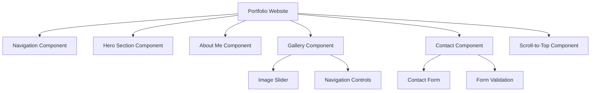

# Static Portfolio Website Design Document

## Overview

This document outlines the design for a single-page static portfolio website featuring smooth scrolling navigation, interactive components, and a responsive layout. The website will showcase personal work and information through distinct sections accessible via a fixed navigation bar.

### Key Features
- Single-page application with smooth scrolling navigation
- Responsive design for all device sizes
- Interactive image gallery with slider functionality
- Contact form integration
- Scroll-to-top functionality
- Modern, clean aesthetic

## Technology Stack & Dependencies

### Core Technologies
- **HTML5**: Semantic markup structure
- **CSS3**: Styling with Flexbox/Grid, animations, and responsive design
- **Vanilla JavaScript**: Interactive functionality and smooth scrolling
- **CSS Frameworks** (Optional): Bootstrap or Tailwind CSS for rapid development

### External Libraries
- **Swiper.js** or **Glide.js**: Gallery slider implementation
- **AOS (Animate On Scroll)**: Scroll-triggered animations
- **EmailJS** (Optional): Contact form functionality without backend

## Component Architecture

### Component Definition

The website follows a sectioned component approach where each major area functions as an independent, reusable component:



### Component Hierarchy

#### 1. Navigation Component
```
<nav class="navbar">
  <div class="nav-container">
    <div class="logo">Portfolio</div>
    <ul class="nav-menu">
      <li><a href="#home">Home</a></li>
      <li><a href="#about">About</a></li>
      <li><a href="#gallery">Gallery</a></li>
      <li><a href="#contact">Contact</a></li>
    </ul>
    <div class="hamburger">☰</div>
  </div>
</nav>
```

**Properties:**
- Fixed positioning
- Mobile hamburger menu
- Active section highlighting
- Smooth scroll navigation

#### 2. Hero Section Component
```
<section id="home" class="hero">
  <div class="hero-content">
    <h1 class="hero-title">Your Name</h1>
    <p class="hero-subtitle">Professional Title</p>
    <button class="cta-button">View My Work</button>
  </div>
  <div class="hero-background">
    <!-- Background image or animation -->
  </div>
</section>
```

**Properties:**
- Full viewport height
- Background image/gradient
- Call-to-action button
- Animated text entrance

#### 3. About Me Component
```
<section id="about" class="about">
  <div class="container">
    <h2 class="section-title">About Me</h2>
    <div class="about-content">
      <div class="about-text">
        <p>Professional description...</p>
        <div class="skills">
          <!-- Skill items -->
        </div>
      </div>
      <div class="about-image">
        
      </div>
    </div>
  </div>
</section>
```

**Properties:**
- Two-column layout (text + image)
- Skills showcase
- Professional summary

#### 4. Gallery Component
```
<section id="gallery" class="gallery">
  <div class="container">
    <h2 class="section-title">My Work</h2>
    <div class="gallery-slider">
      <div class="slides-container">
        <!-- Project slides -->
      </div>
      <div class="slider-controls">
        <button class="prev">‹</button>
        <button class="next">›</button>
      </div>
      <div class="slider-indicators">
        <!-- Dot indicators -->
      </div>
    </div>
  </div>
</section>
```

**Properties:**
- Image/project slider
- Navigation arrows
- Dot indicators
- Touch/swipe support
- Auto-play functionality

#### 5. Contact Component
```
<section id="contact" class="contact">
  <div class="container">
    <h2 class="section-title">Get In Touch</h2>
    <div class="contact-content">
      <div class="contact-info">
        <!-- Contact details -->
      </div>
      <form class="contact-form">
        <input type="text" name="name" placeholder="Name" required>
        <input type="email" name="email" placeholder="Email" required>
        <textarea name="message" placeholder="Message" required></textarea>
        <button type="submit">Send Message</button>
      </form>
    </div>
  </div>
</section>
```

**Properties:**
- Contact form with validation
- Contact information display


