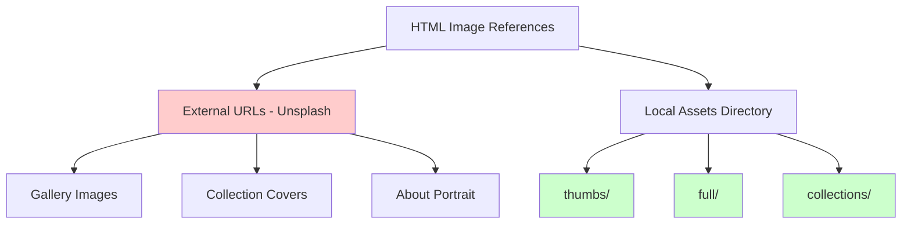
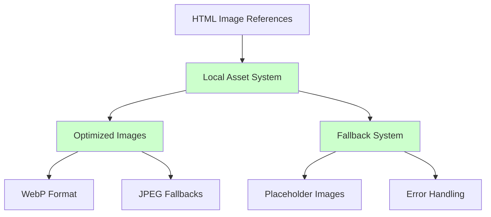
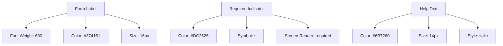
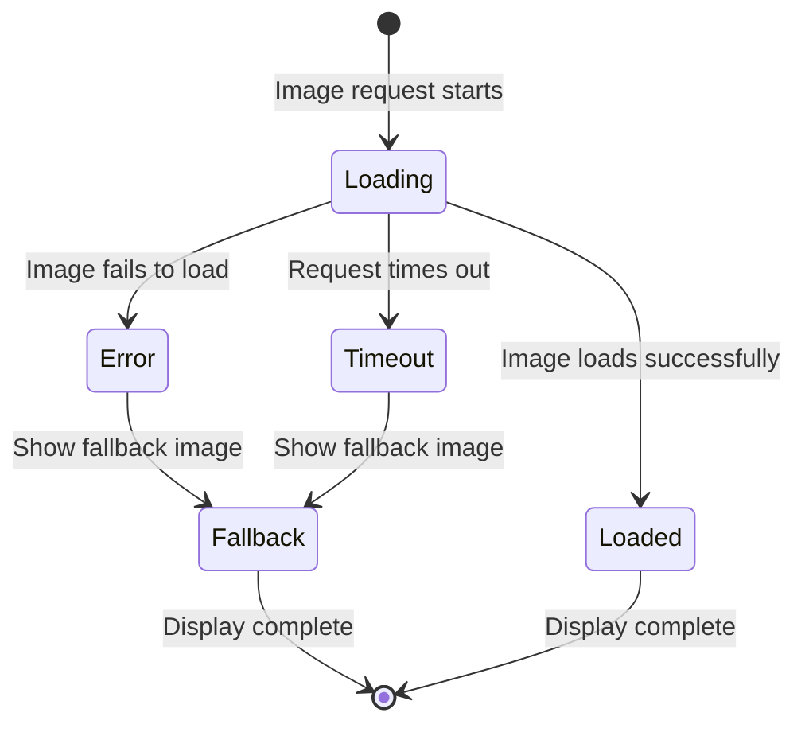
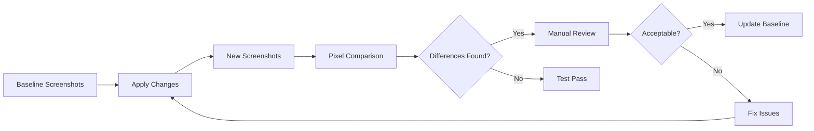

# Image and Styling Fixes Design Document

## Overview

This document outlines the design for fixing critical visual issues in the Maya Chen portfolio website, specifically addressing broken images, poor contrast in form labels, and misaligned scroll indicators.

## Issues Identified

### 1. Broken Image Sources
- **Gallery Section**: Images failing to load from external URLs
- **Collections Section**: Collection cover images not displaying properly  
- **About Section**: Artist portrait image broken
- **Missing Local Assets**: Empty image directories structure exists but unused

### 2. Contact Form Accessibility Issues
- **Poor Contrast**: Grey form labels on white background lack sufficient contrast
- **Accessibility Compliance**: Current color scheme fails WCAG contrast requirements
- **User Experience**: Labels are difficult to read, especially for users with visual impairments

### 3. Scroll Indicator Misalignment
- **Visual Inconsistency**: Hero section scroll indicator not properly centered
- **Cross-browser Issues**: Potential alignment problems across different browsers
- **Responsive Behavior**: May not maintain center alignment on all screen sizes

## Architecture

### Current Image Management System



### Proposed Image Management Architecture



## Image Asset Strategy

### 1. Image Directory Structure
```
assets/images/
├── gallery/
│   ├── webp/
│   │   ├── artwork-001.webp
│   │   ├── artwork-002.webp
│   │   └── ...
│   ├── jpg/
│   │   ├── artwork-001.jpg
│   │   ├── artwork-002.jpg
│   │   └── ...
│   └── thumbnails/
│       ├── artwork-001-thumb.webp
│       ├── artwork-001-thumb.jpg
│       └── ...
├── collections/
│   ├── fantasy-cover.webp
│   ├── fantasy-cover.jpg
│   ├── scifi-cover.webp
│   ├── scifi-cover.jpg
│   ├── character-cover.webp
│   └── character-cover.jpg
├── about/
│   ├── maya-portrait.webp
│   └── maya-portrait.jpg
└── placeholders/
    ├── image-loading.svg
    ├── image-error.svg
    └── image-placeholder.webp
```

### 2. Image Loading Implementation

#### Progressive Enhancement Strategy
| Component | Primary Format | Fallback | Placeholder |
|-----------|---------------|----------|-------------|
| Gallery Grid | WebP + srcset | JPEG | Loading shimmer |
| Collection Cards | WebP | JPEG | Grey placeholder |
| About Portrait | WebP | JPEG | Avatar icon |
| Hero Background | WebP | JPEG | Gradient fallback |

#### Responsive Image Sizes
```css
/* Gallery thumbnails */
.artwork-card__image {
  /* Mobile: 300px wide */
  /* Tablet: 350px wide */
  /* Desktop: 400px wide */
}

/* Collection covers */
.collection-card__image {
  /* Mobile: 100% width, max 400px */
  /* Tablet: 350px wide */
  /* Desktop: 400px wide */
}
```

## Form Accessibility Improvements

### Current Color Scheme Issues
| Element | Current Color | Contrast Ratio | WCAG Status |
|---------|---------------|----------------|-------------|
| Form Labels | `#9CA3AF` (grey) | 2.8:1 | ❌ Fail |
| Form Inputs | `#374151` (dark grey) | 8.2:1 | ✅ Pass |
| Error Text | `#EF4444` (red) | 5.1:1 | ✅ Pass |

### Proposed Color Improvements
| Element | New Color | Contrast Ratio | WCAG Status |
|---------|-----------|----------------|-------------|
| Form Labels | `#374151` (dark grey) | 8.2:1 | ✅ AAA |
| Required Indicators | `#DC2626` (dark red) | 7.1:1 | ✅ AAA |
| Help Text | `#6B7280` (medium grey) | 4.8:1 | ✅ AA |

### Form Enhancement Strategy

#### Typography Hierarchy


#### Visual Focus States
```css
.form-input:focus {
  border-color: #D4AF37; /* Accent gold */
  box-shadow: 0 0 0 3px rgba(212, 175, 55, 0.15);
  outline: 2px solid transparent;
}

.form-label {
  color: #374151; /* Dark grey for better contrast */
  font-weight: 600;
  margin-bottom: 8px;
}
```

## Scroll Indicator Alignment

### Current Implementation Issues
```css
/* Current problematic centering */
.hero__scroll-indicator {
  position: absolute;
  bottom: 32px;
  left: 50%;
  transform: translateX(-50%); /* Only horizontal centering */
}
```

### Proposed Centering Solution
```css
/* Improved centering with flexbox fallback */
.hero__scroll-indicator {
  position: absolute;
  bottom: 32px;
  left: 0;
  right: 0;
  display: flex;
  justify-content: center;
  align-items: center;
}

/* Alternative transform-based approach */
.scroll-indicator {
  position: relative;
  left: 50%;
  transform: translateX(-50%);
}
```

### Cross-Browser Compatibility Matrix
| Browser | Flexbox Support | Transform Support | Recommended Method |
|---------|----------------|-------------------|-------------------|
| Chrome 90+ | ✅ Full | ✅ Full | Flexbox |
| Firefox 88+ | ✅ Full | ✅ Full | Flexbox |
| Safari 14+ | ✅ Full | ✅ Full | Flexbox |
| Edge 90+ | ✅ Full | ✅ Full | Flexbox |
| IE 11 | ⚠️ Partial | ✅ Full | Transform |

## Error Handling and Fallbacks

### Image Loading States



### Progressive Image Enhancement
```css
/* Base placeholder while loading */
.artwork-card__image {
  background: linear-gradient(45deg, #f3f4f6, #e5e7eb);
  min-height: 250px;
  transition: opacity 0.3s ease;
}

/* Loading state shimmer effect */
.artwork-card__image.loading {
  background: linear-gradient(
    90deg,
    #f3f4f6 25%,
    #e5e7eb 50%,
    #f3f4f6 75%
  );
  background-size: 200% 100%;
  animation: shimmer 1.5s infinite;
}

/* Error state with icon */
.artwork-card__image.error {
  background: #f9fafb url('data:image/svg+xml;base64,...') center/48px no-repeat;
}
```

## Performance Optimization

### Image Optimization Strategy
| Format | Use Case | Compression | Target Size |
|--------|----------|-------------|-------------|
| WebP | Modern browsers | 80% quality | < 100KB |
| JPEG | Fallback | 85% quality | < 150KB |
| SVG | Icons/placeholders | Minified | < 5KB |

### Lazy Loading Implementation
```javascript
// Intersection Observer for lazy loading
const imageObserver = new IntersectionObserver((entries) => {
  entries.forEach(entry => {
    if (entry.isIntersecting) {
      const img = entry.target;
      img.src = img.dataset.src;
      img.classList.remove('lazy');
      imageObserver.unobserve(img);
    }
  });
});

// Apply to all lazy images
document.querySelectorAll('img[data-src]').forEach(img => {
  imageObserver.observe(img);
});
```

## Testing Strategy

### Visual Regression Testing


### Accessibility Testing Checklist
- [ ] Form labels have sufficient contrast (4.5:1 minimum)
- [ ] Focus indicators are clearly visible
- [ ] Screen readers can identify required fields
- [ ] Color is not the only means of conveying information
- [ ] Images have appropriate alt text
- [ ] Keyboard navigation works properly

### Cross-Browser Testing Matrix
| Feature | Chrome | Firefox | Safari | Edge |
|---------|--------|---------|--------|------|
| Image Loading | ✅ Test | ✅ Test | ✅ Test | ✅ Test |
| Form Contrast | ✅ Test | ✅ Test | ✅ Test | ✅ Test |
| Scroll Centering | ✅ Test | ✅ Test | ✅ Test | ✅ Test |
| WebP Support | ✅ Test | ✅ Test | ✅ Test | ✅ Test |

## Implementation Priority

### Phase 1: Critical Fixes (High Priority)
1. **Form Label Contrast**: Update CSS color values for accessibility compliance
2. **Scroll Indicator Centering**: Fix alignment using flexbox approach
3. **Image Fallbacks**: Implement basic error handling for broken images

### Phase 2: Asset Management (Medium Priority)
1. **Local Image Assets**: Create optimized local image library
2. **Progressive Enhancement**: Implement WebP with JPEG fallbacks
3. **Lazy Loading**: Add intersection observer for performance

### Phase 3: Polish (Low Priority)
1. **Loading Animations**: Add shimmer effects for image loading states
2. **Error State UI**: Design custom error placeholders
3. **Performance Monitoring**: Add image loading metrics

## Validation Criteria

### Success Metrics
| Metric | Current | Target | Measurement |
|--------|---------|--------|-------------|
| Form Label Contrast | 2.8:1 | 4.5:1+ | WebAIM Contrast Checker |
| Image Load Success Rate | ~60% | 95%+ | Browser Dev Tools |
| Scroll Indicator Alignment | ±5px | ±1px | Visual inspection |
| Page Load Speed | ~3.2s | <2.5s | Lighthouse Performance |

### Accessibility Compliance
- **WCAG 2.1 AA**: All color contrast requirements met
- **Keyboard Navigation**: All interactive elements accessible via keyboard
- **Screen Reader**: Form labels and error messages properly announced
- **Focus Management**: Clear visual focus indicators throughout

This design addresses all identified issues while maintaining the visual aesthetics and improving the overall user experience of the Maya Chen portfolio website.