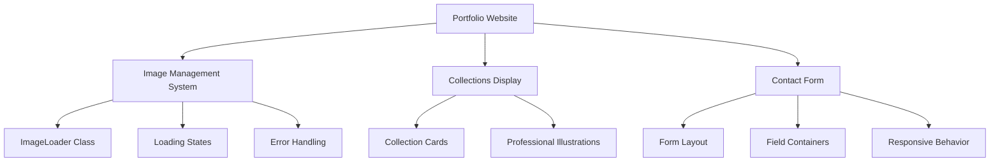
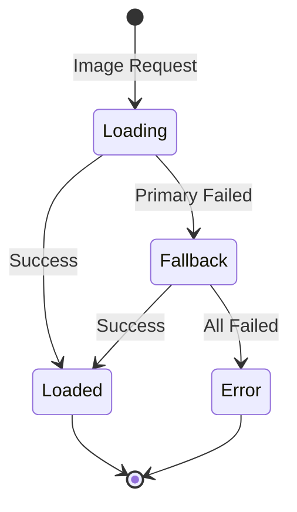
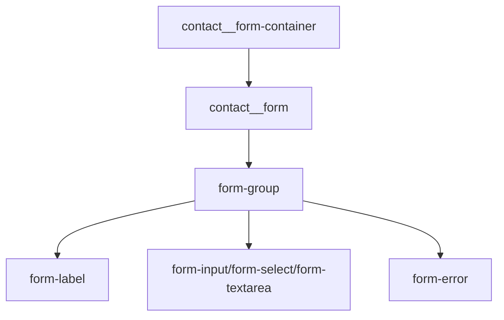

# Image Optimization and Collection Illustration Upgrade

## Overview

This design document addresses three critical improvements to the digital artist portfolio website:

1. **Image Loading Performance**: Optimize image loading states to prevent persistent loading indicators
2. **Professional Collection Illustrations**: Replace placeholder images with custom, cohesive collection artwork
3. **Contact Form Layout Fix**: Resolve form field overflow issues causing elements to render outside their container

## Architecture

### Frontend Application Technology Stack
- **Framework**: Vanilla JavaScript with HTML5/CSS3
- **Image Management**: Custom ImageLoader class with progressive loading
- **Styling**: Modular CSS with CSS Grid and Flexbox layouts  
- **Asset Structure**: Local image directory with format optimization

### Component Architecture



## Image Loading System Enhancement

### Current Issue Analysis
The existing ImageLoader correctly maps external URLs to local assets but has gaps in the loading state management that cause persistent "Loading..." placeholders.

### Solution Architecture

#### Loading State Management


#### Enhanced ImageLoader Features
- **Progressive Loading**: WebP → JPG → SVG fallback chain
- **Smart Placeholders**: Context-aware loading states
- **Performance Monitoring**: Track load times and failure rates
- **Intersection Observer**: Optimized lazy loading

### Implementation Strategy

#### Image Asset Hierarchy
| Asset Type | Primary Format | Fallback | Placeholder |
|------------|---------------|----------|-------------|
| Gallery Images | WebP | JPG | Loading SVG |
| Collection Covers | Custom SVG | WebP | Generic SVG |
| Thumbnails | WebP Thumbnails | Full JPG | Shimmer |
| About Photo | WebP | JPG | Avatar SVG |

#### Loading State Visual Design
- **Shimmer Animation**: Subtle gradient sweep for skeleton loading
- **Progressive Reveal**: Fade-in effect with blur-to-sharp transition
- **Error States**: Branded error graphics with retry options

## Professional Collection Illustrations

### Current State Assessment
Collections currently use generic Unsplash stock photos that lack cohesion and professional branding.

### Design Requirements

#### Visual Consistency Framework
- **Art Style**: Minimalist line art with selective color accents
- **Color Palette**: Consistent with site branding (#D4AF37 accent)
- **Composition**: Standard 3:2 aspect ratio, centered subjects
- **Themes**: Reflect each collection's artistic focus

#### Collection-Specific Illustrations

##### Fantasy Illustrations Collection
```
Design Elements:
- Mystical symbols (staff, crystal, runes)
- Flowing magical elements
- Rich purples and golds
- Ethereal lighting effects
```

##### Sci-Fi Concepts Collection  
```
Design Elements:
- Geometric futuristic shapes
- Technology interfaces
- Cool blues and cyans
- Clean minimalist aesthetic
```

##### Character Designs Collection
```
Design Elements:
- Stylized character silhouettes
- Dynamic poses and expressions
- Warm earth tones
- Artistic tool references
```

### Asset Production Pipeline
1. **Concept Sketches**: Initial wireframe layouts
2. **Vector Creation**: SVG format for scalability
3. **Color Application**: Brand-aligned palette implementation
4. **Optimization**: File size and loading performance
5. **Fallback Generation**: Multiple format creation

## Contact Form Layout Resolution

### Issue Diagnosis
Form fields overflow their container due to:
- Missing container width constraints
- Inadequate responsive breakpoint handling
- Box-sizing inheritance issues

### Form Layout Architecture

#### Container Structure


#### Responsive Layout Strategy

| Breakpoint | Layout Strategy | Form Width |
|------------|----------------|------------|
| Mobile (< 768px) | Single column, full width | 100% |
| Tablet (768px - 1023px) | Single column, constrained | max-width: 600px |
| Desktop (> 1024px) | Side-by-side with contact info | Grid: 450px 1fr |

### CSS Architecture Improvements

#### Container Constraints
```css
.contact__form-container {
  width: 100%;
  max-width: 100%;
  box-sizing: border-box;
  overflow: hidden;
}

.form-group {
  width: 100%;
  box-sizing: border-box;
}
```

#### Field Sizing Strategy
- **Inputs**: `width: 100%` with `box-sizing: border-box`
- **Padding**: Consistent internal spacing
- **Margins**: Standardized vertical rhythm

## Testing Strategy

### Image Loading Tests
- **Performance Testing**: Load time measurement across asset types
- **Fallback Validation**: Ensure graceful degradation
- **Error Handling**: Verify error state appearance and functionality
- **Cross-Browser Testing**: Safari, Chrome, Firefox, Edge compatibility

### Collection Illustration Tests
- **Visual Consistency**: Brand alignment verification
- **Responsive Behavior**: Multi-device display testing
- **Accessibility**: Alt text and contrast validation
- **Loading Performance**: File size and render speed testing

### Form Layout Tests
- **Container Boundaries**: Field overflow prevention
- **Responsive Breakpoints**: Layout integrity across device sizes
- **Input Validation**: Error state display and positioning
- **Keyboard Navigation**: Focus management and accessibility

### Cross-Device Validation Matrix

| Test Category | Mobile | Tablet | Desktop | Ultra-wide |
|---------------|--------|--------|---------|------------|
| Image Loading | ✓ | ✓ | ✓ | ✓ |
| Form Layout | ✓ | ✓ | ✓ | ✓ |
| Collections | ✓ | ✓ | ✓ | ✓ |
| Performance | ✓ | ✓ | ✓ | ✓ |

## Technical Implementation Approach

### Image System Enhancements
1. **Extend ImageLoader**: Add format preference cascade
2. **Implement Observers**: Enhanced intersection observer patterns
3. **Create Asset Maps**: Comprehensive local asset inventory
4. **Performance Monitoring**: Loading analytics and optimization

### Collection Illustration Creation
1. **Asset Design**: Custom SVG illustration creation
2. **Format Optimization**: Multi-format asset generation
3. **Integration Testing**: Asset loading and display verification
4. **Brand Consistency**: Visual alignment confirmation

### Form Layout Corrections
1. **CSS Refactoring**: Container and field sizing improvements
2. **Responsive Testing**: Multi-breakpoint validation
3. **Accessibility Review**: Focus management and keyboard navigation
4. **Cross-Browser Validation**: Consistent behavior verification