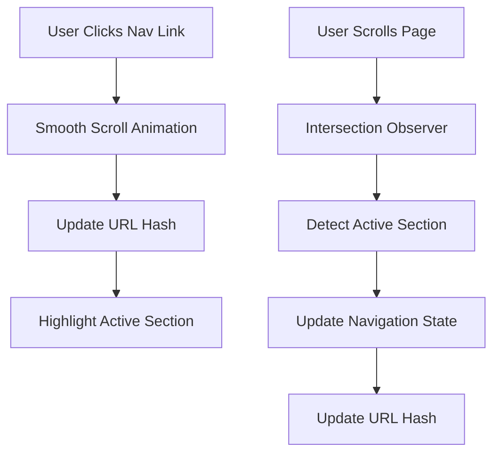
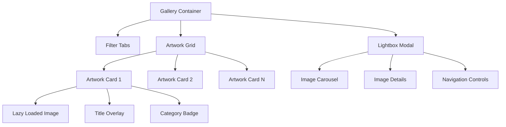
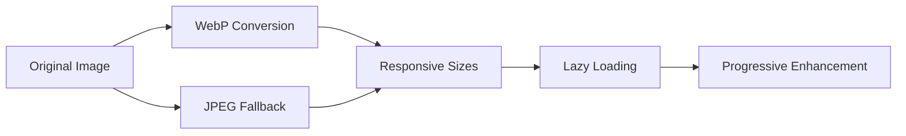

# Digital Artist Portfolio Website Design

## Overview

A static single-page portfolio website designed for a digital artist, featuring smooth scrolling navigation and a clean, image-focused aesthetic. The website showcases artwork through an intuitive layout with dedicated sections for different content types.

**Target Audience**: Art enthusiasts, potential clients, gallery owners, and art collectors  
**Primary Goal**: Showcase digital artwork portfolio and facilitate client contact  
**Platform**: Static website (HTML/CSS/JavaScript)  
**Design Philosophy**: Minimalist, artwork-first approach with emphasis on visual storytelling

## Technology Stack & Dependencies

- **Frontend Framework**: Vanilla HTML5, CSS3, JavaScript (ES6+)
- **Styling**: CSS Grid, Flexbox, CSS Custom Properties
- **Animation**: CSS Transitions, Intersection Observer API for scroll effects
- **Image Optimization**: WebP format with JPEG fallbacks
- **Icons**: Font Awesome or custom SVG icons
- **Typography**: Google Fonts (elegant serif/sans-serif combination)
- **Build Tools**: Optional bundler (Vite/Parcel) for development
- **Hosting**: Static hosting (Netlify, Vercel, GitHub Pages)

## Component Architecture

### Navigation Component
```
Navbar
├── Logo/Artist Name
├── Navigation Links
│   ├── Home (Hero)
│   ├── Gallery
│   ├── Collections
│   ├── About
│   └── Contact
└── Mobile Menu Toggle
```

**Behavior**:
- Fixed position with background blur on scroll
- Smooth scroll to section anchors
- Active state highlighting based on scroll position
- Responsive hamburger menu for mobile

### Hero Section Component
```
Hero
├── Background Image/Video
├── Artist Name Typography
├── Tagline/Subtitle
├── Call-to-Action Button
└── Scroll Indicator
```

**Content Elements**:
- Large artist name with elegant typography
- Professional tagline (e.g., "Digital Artist & Illustrator")
- Featured artwork as background
- Scroll down indicator animation

### Gallery Section Component
```
Gallery
├── Section Header
├── Filter/Category Tabs
├── Artwork Grid
│   └── Artwork Cards
│       ├── Image
│       ├── Title Overlay
│       └── Quick View Modal
└── Carousel/Slideshow View
```

**Functionality**:
- Masonry or CSS Grid layout for artwork display
- Lightbox modal for full-size viewing
- Carousel navigation (previous/next)
- Category filtering (illustrations, concept art, commissions)
- Lazy loading for performance optimization

### Collections Section Component
```
Collections
├── Section Header
├── Collection Grid
│   └── Collection Cards
│       ├── Cover Image
│       ├── Collection Title
│       ├── Artwork Count
│       └── View Collection Link
└── Collection Detail Modal
```

**Content Structure**:
- Curated artwork series or themes
- Book covers, personal projects, commissioned work
- Each collection leads to filtered gallery view

### About Section Component
```
About
├── Artist Photo
├── Biography Text
├── Skills/Expertise List
├── Client Logos
└── Social Media Links
```

**Content Elements**:
- Professional portrait
- Artist statement and background
- Technical skills and software proficiency
- Notable clients or publications
- Links to social platforms and art communities

### Contact Section Component
```
Contact
├── Contact Form
│   ├── Name Input
│   ├── Email Input
│   ├── Project Type Select
│   ├── Message Textarea
│   └── Submit Button
├── Contact Information
└── Commission Information
```

**Functionality**:
- Form validation and submission
- Contact details (email, social media)
- Commission rates and process information
- Response time expectations

## Routing & Navigation

### Scroll-Based Navigation System


**Implementation Details**:
- Single-page application with hash-based routing
- Intersection Observer API for scroll position detection
- CSS `scroll-behavior: smooth` with JavaScript fallback
- Navigation state management for active section highlighting

### Section Navigation Flow
```
Hero Section (#home)
    ↓ (scroll/click)
Gallery Section (#gallery)
    ↓ (scroll/click)
Collections Section (#collections)
    ↓ (scroll/click)
About Section (#about)
    ↓ (scroll/click)
Contact Section (#contact)
```

## Styling Strategy

### CSS Architecture
- **Methodology**: BEM (Block Element Modifier) naming convention
- **Layout**: CSS Grid for main layout, Flexbox for components
- **Responsive Design**: Mobile-first approach with breakpoints
- **Color Scheme**: Neutral palette with accent colors highlighting artwork

### Design System
```css
:root {
  /* Typography */
  --font-primary: 'Playfair Display', serif;
  --font-secondary: 'Inter', sans-serif;
  
  /* Colors */
  --color-primary: #1a1a1a;
  --color-secondary: #f8f8f8;
  --color-accent: #d4af37;
  --color-text: #333333;
  
  /* Spacing */
  --spacing-xs: 0.5rem;
  --spacing-sm: 1rem;
  --spacing-md: 2rem;
  --spacing-lg: 4rem;
  --spacing-xl: 6rem;
  
  /* Breakpoints */
  --bp-mobile: 480px;
  --bp-tablet: 768px;
  --bp-desktop: 1024px;
  --bp-wide: 1440px;
}
```

### Responsive Breakpoints
- **Mobile**: 320px - 767px (single column, stacked layout)
- **Tablet**: 768px - 1023px (2-3 column grid)
- **Desktop**: 1024px - 1439px (multi-column grid)
- **Wide Desktop**: 1440px+ (maximum width container)

## State Management

### Application State Structure
```javascript
const portfolioState = {
  currentSection: 'hero',
  galleryFilter: 'all',
  modalState: {
    isOpen: false,
    currentImage: null,
    currentIndex: 0
  },
  carouselState: {
    currentSlide: 0,
    totalSlides: 0
  },
  formState: {
    isSubmitting: false,
    isValid: false,
    errors: {}
  }
};
```

### State Management Patterns
- **Vanilla JavaScript**: Event-driven state updates
- **Local Storage**: Persist user preferences (theme, filter settings)
- **Session Management**: Track form progress and modal states
- **URL State**: Maintain current section in hash for bookmarking

## Image Gallery Architecture

### Gallery Data Structure
```javascript
const artworkData = [
  {
    id: 'artwork-001',
    title: 'Mystical Forest',
    category: 'illustration',
    collection: 'fantasy-series',
    thumbnail: 'images/thumbs/mystical-forest-thumb.webp',
    fullSize: 'images/full/mystical-forest.webp',
    alt: 'Digital illustration of mystical forest scene',
    dimensions: '3000x4000',
    year: 2024,
    medium: 'Digital Painting',
    description: 'A atmospheric forest scene with magical elements'
  }
];
```

### Gallery Component Hierarchy


### Carousel Implementation
```javascript
class ArtworkCarousel {
  constructor(images, startIndex = 0) {
    this.images = images;
    this.currentIndex = startIndex;
    this.totalImages = images.length;
  }
  
  nextImage() {
    this.currentIndex = (this.currentIndex + 1) % this.totalImages;
  }
  
  previousImage() {
    this.currentIndex = this.currentIndex === 0 
      ? this.totalImages - 1 
      : this.currentIndex - 1;
  }
  
  goToImage(index) {
    this.currentIndex = Math.max(0, Math.min(index, this.totalImages - 1));
  }
}
```

## API Integration Layer

### Static Data Management
```javascript
// Data structure for static content
const portfolioData = {
  artist: {
    name: 'Artist Name',
    tagline: 'Digital Artist & Illustrator',
    bio: 'Artist biography and background...',
    skills: ['Digital Painting', 'Concept Art', 'Illustration'],
    social: {
      instagram: '@artisthandle',
      artstation: 'artistname',
      email: 'artist@example.com'
    }
  },
  
  collections: [
    {
      id: 'fantasy-art',
      title: 'Fantasy Illustrations',
      description: 'Epic fantasy scenes and characters',
      coverImage: 'images/collections/fantasy-cover.webp',
      artworkIds: ['artwork-001', 'artwork-002']
    }
  ],
  
  contact: {
    email: 'commissions@example.com',
    commissionsOpen: true,
    responseTime: '24-48 hours',
    rates: {
      illustration: '$500-2000',
      conceptArt: '$300-1000',
      bookCover: '$1000-3000'
    }
  }
};
```

### Form Handling
```javascript
class ContactForm {
  constructor(formElement) {
    this.form = formElement;
    this.validator = new FormValidator();
    this.setupEventListeners();
  }
  
  async submitForm(formData) {
    try {
      // Form submission to Netlify Forms or similar service
      const response = await fetch('/submit-form', {
        method: 'POST',
        body: new FormData(this.form)
      });
      
      if (response.ok) {
        this.showSuccessMessage();
        this.resetForm();
      } else {
        throw new Error('Submission failed');
      }
    } catch (error) {
      this.showErrorMessage(error.message);
    }
  }
}
```

## Testing Strategy

### Unit Testing Approach
```javascript
// Example test structure for gallery functionality
describe('Gallery Component', () => {
  test('filters artwork by category', () => {
    const gallery = new Gallery(mockArtworkData);
    gallery.filterByCategory('illustration');
    expect(gallery.getVisibleArtwork()).toHaveLength(5);
  });
  
  test('opens lightbox with correct image', () => {
    const gallery = new Gallery(mockArtworkData);
    gallery.openLightbox(2);
    expect(gallery.modal.getCurrentImage().id).toBe('artwork-003');
  });
});
```

### Integration Testing
- **Cross-browser compatibility** (Chrome, Firefox, Safari, Edge)
- **Responsive design testing** across device sizes
- **Performance testing** for image loading and animations
- **Accessibility testing** with screen readers and keyboard navigation

### Testing Tools
- **Jest**: Unit testing framework
- **Playwright**: End-to-end testing
- **Lighthouse**: Performance and accessibility auditing
- **Axe**: Accessibility testing
- **BrowserStack**: Cross-browser testing

## Performance Optimization

### Image Optimization Strategy


### Loading Strategy
- **Critical Path**: Above-the-fold content loads first
- **Lazy Loading**: Images load as they enter viewport
- **Preloading**: Next/previous carousel images
- **Caching**: Service worker for static assets
- **CDN**: Image delivery optimization

### Bundle Optimization
- **CSS**: Critical CSS inlined, non-critical loaded async
- **JavaScript**: Split into modules, loaded as needed
- **Images**: Multiple formats and sizes with picture element
- **Fonts**: Font-display: swap for faster text rendering

## Accessibility Considerations

### WCAG 2.1 AA Compliance
- **Keyboard Navigation**: All interactive elements accessible via keyboard
- **Screen Reader Support**: Proper ARIA labels and semantic HTML
- **Color Contrast**: Minimum 4.5:1 ratio for text
- **Focus Management**: Clear focus indicators and logical tab order
- **Alternative Text**: Descriptive alt text for all artwork

### Implementation Details
```html
<!-- Example accessible gallery item -->
<article class="artwork-card" role="img" aria-labelledby="artwork-1-title">
  
  <div class="artwork-overlay">
    <h3 id="artwork-1-title">Mystical Forest</h3>
    <button 
      class="view-artwork" 
      aria-label="View full size image of Mystical Forest"
      data-artwork-id="1"
    >
      View Full Size
    </button>
  </div>
</article>
```